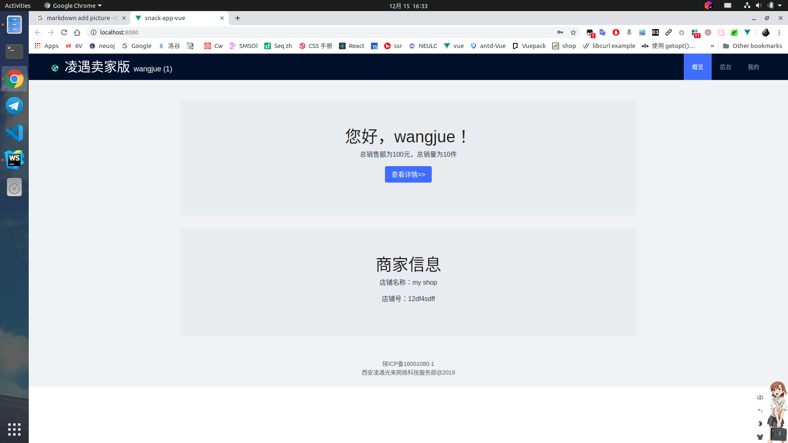
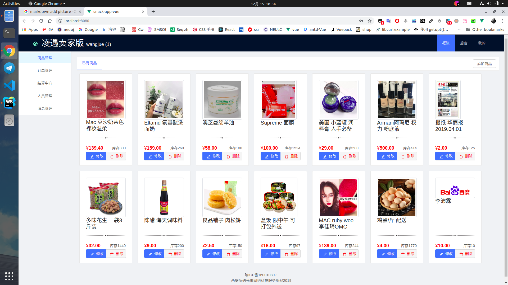
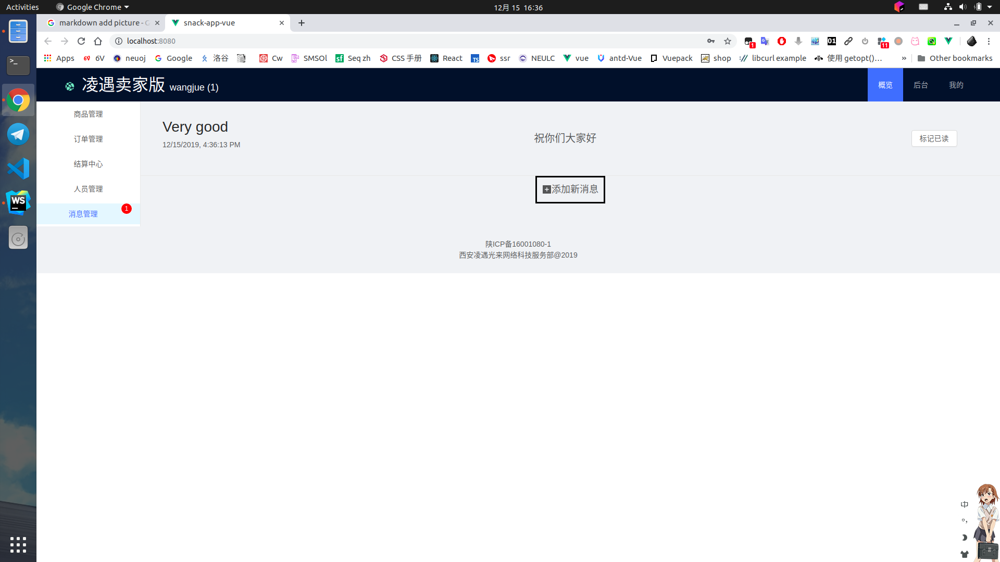

# snack-app
凌遇前端。

## 综述
Vue写就，项目总体耗时极长。为了完成此程序设计作业，将之前有的一个半成品
snack-app继续进行二次开发，开发周期极长，从而形成了此项目。

本项目开发目的非常明确，形成一套商品管理系统，可以进行人员/消息/商品的管理。

一些截图。

## 默认
默认账号luobendong
密码abcdefg

## 不足
人员管理模块未完成，但无所谓了。
